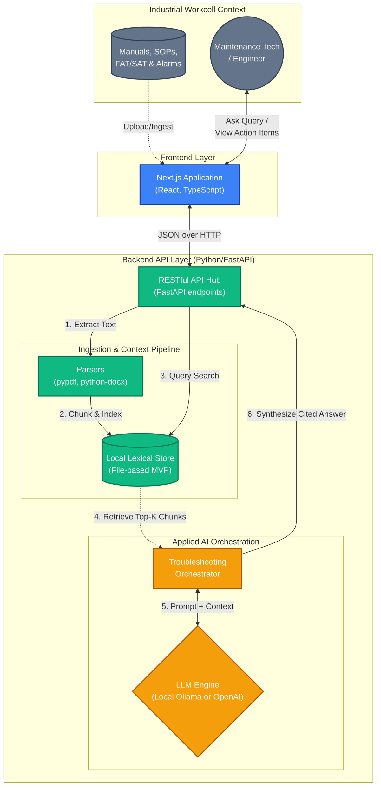
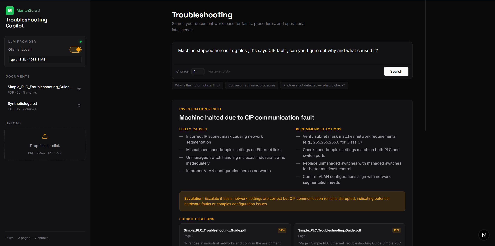
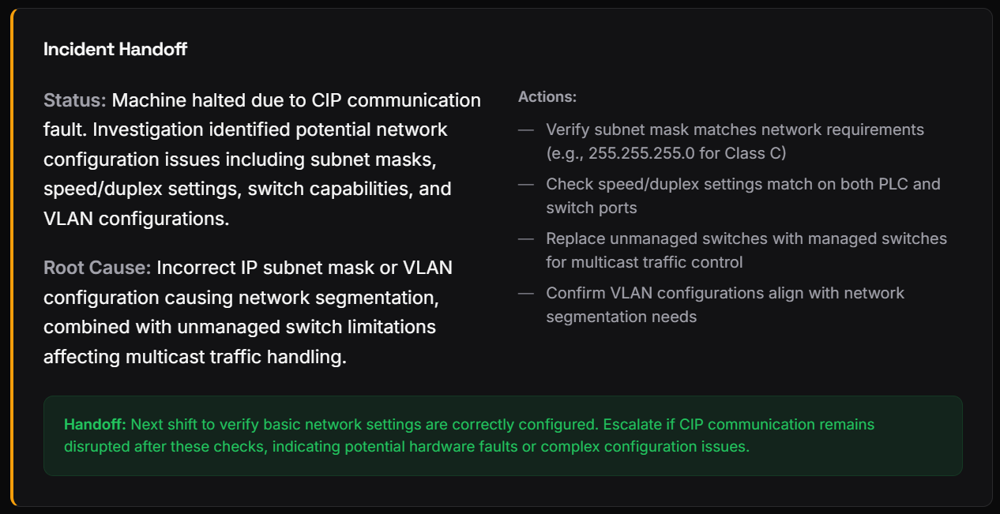

# Industrial Troubleshooting Copilot

Domain-specific AI copilot for industrial troubleshooting.

## Goal
Ingest manuals, SOPs, FAT/SAT docs, alarm guides, and troubleshooting notes, then answer industrial troubleshooting questions with citations, recommended next actions, and incident summaries.

## Key Features
- Connects industrial automation domain expertise with applied artificial intelligence
- Demonstrates an end-to-end RAG architecture: backend API, document retrieval pipeline, modern frontend UX, robust test coverage, and containerization
- Provides a pragmatic foundation that can be extended into a production-grade industrial AI assistant

## MVP capabilities
- Upload PDF, DOCX, TXT, MD, and LOG files
- Parse and chunk technical documents
- Store indexed chunks locally for retrieval
- Ask troubleshooting questions and get:
  - issue summary
  - likely causes
  - recommended actions
  - escalation note
  - source citations
- Generate an incident handoff summary from the current troubleshooting context
- Review and delete uploaded documents from the UI

## Current Architecture
- **Frontend**: Next.js 14 + TypeScript
- **Backend**: FastAPI + Python
- **Retrieval**: local lexical chunk search store (MVP)
- **Parsing**: `pypdf` + `python-docx`
- **Container support**: Docker + docker-compose

### Architecture Flow



### Design Rationale: Bridging Automation & AI
Coming from a background in industrial automation, the architecture of this project focuses heavily on **pragmatism, robustness, and predictable data flow** (similar to PLC logic!). Recent AI/ML learnings are applied deliberately:
- **Local-First AI**: Just as we wouldn't want a machine's safety loop to rely on cloud latency, the capability to run local, open-source models (via `Ollama`) allows operators to maintain data privacy and uptime in airgapped environments if needed.
- **RAG Architecture**: Instead of just using a raw LLM, we ground the AI's responses strictly in the "ground truth" of the factory—SOPs, FAT/SAT documents, and troubleshooting guides—similar to reading the actual physical OEM manual.
- **The "Starter" Retrieval Store**: We are using a local lexical store for the MVP. While vector databases (like Chroma) are standard for semantic search in ML, a simple chunk store is enough to deliver high value quickly without the configuration overhead. The pipeline is intentionally decoupled so swapping in an embedding model later is a simple, isolated update.

## Important Note
This project currently uses a **local lexical retrieval store** rather than vector embeddings.
This design choice ensures a simple, self-contained setup that is easy to deploy and test locally without requiring external APIs.
The repository structure is designed with a clean upgrade path to vector databases like Chroma or pgvector, and embedding models via OpenAI or pure local models via Ollama.

## Screens / user flow
1. Upload industrial documents
2. Review indexed docs and chunk counts
3. Ask a troubleshooting question
4. Inspect cited answer + recommended actions
5. Generate an incident summary for handoff

## Repo structure
```text
industrial-troubleshooting-copilot/
├── app/
│   ├── backend/        # FastAPI backend
│   └── frontend/       # Next.js frontend
├── data/
│   └── sample-docs/    # Demo sample files
├── docs/               # Architecture, API, schema, setup notes
├── infra/              # Docker / deployment notes
├── scripts/            # Local dev helpers
└── tests/              # Backend smoke tests
```

## Quick start
### 1) Backend
```bash
cd app/backend
python3 -m venv ../../.venv-backend
source ../../.venv-backend/bin/activate
pip install -r requirements.txt
uvicorn main:app --reload --host 0.0.0.0 --port 8000
```

### 2) Frontend
```bash
cd app/frontend
npm install
npm run dev
```

### 3) Open the app
- Frontend: `http://localhost:3000`
- Backend health: `http://localhost:8000/health`
- API docs: `http://localhost:8000/docs`

## Environment
Copy `.env.example` to `.env` at the project root.

```bash
cp .env.example .env
```

Default frontend/backend dev URLs:
- frontend: `http://localhost:3000`
- backend: `http://localhost:8000`

## Sample demo prompt ideas
- Why is the motor not starting?
- Why is the conveyor not running after reset?
- What should I check if the photoeye is not detected?
- Generate an incident summary for this startup fault.

## API summary
- `POST /api/upload`
- `POST /api/ask`
- `POST /api/incident-summary`
- `GET /api/documents`
- `DELETE /api/documents/{document_id}`

See `docs/API_SPEC.md` for contract details.

## Local tests
```bash
cd app/backend
../../.venv-backend/bin/pytest ../../tests/backend/test_smoke_backend.py
```

## Docker
```bash
docker compose -f infra/docker-compose.yml up --build
```

## Next upgrades
- OpenAI/embedding-backed retrieval
- richer industrial answer orchestration
- incident timeline + notes
- auth + multi-user workspaces
- document tagging by machine / line / station / OEM
- exportable PDF incident report

## Application Screenshot



## Incident Handoff quick report

